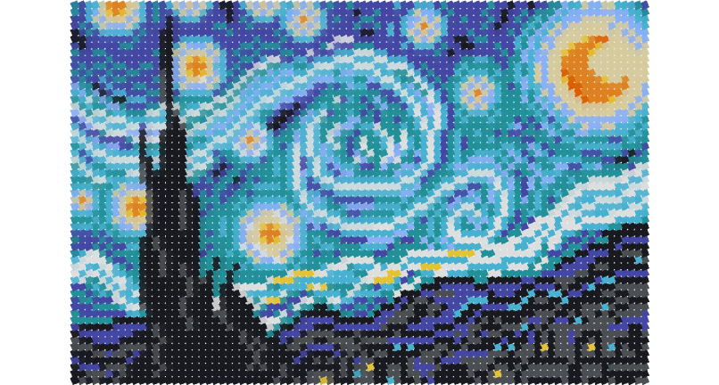
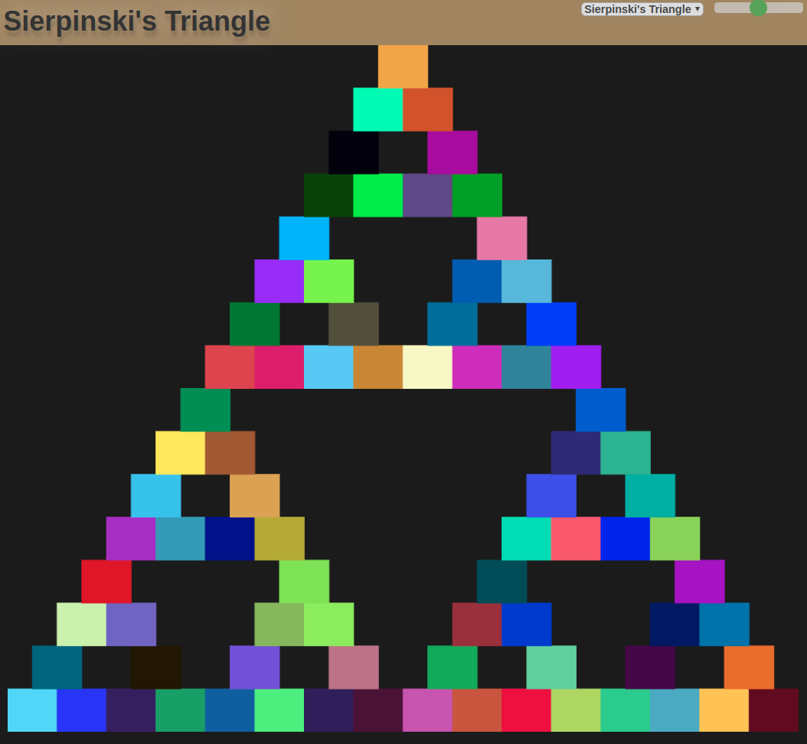
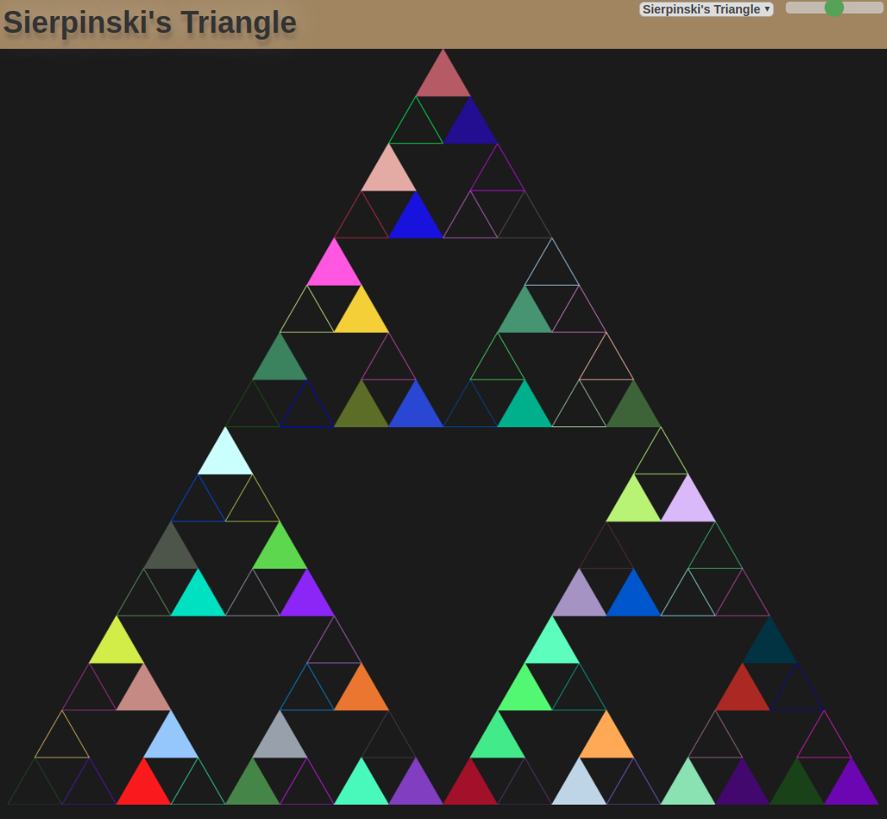

<p align="center">
  
</p>
<h1 align="center">
  Fractals Et Cetera
</h1>

This was just a project that I decided on to get better with
[React][1] and [JavaScript][2] because I had not done much programming
with either. As my interest in web-development piqued, I decided on
making an "interesting" website.

## Getting Started

The project was initialised using the [`create-react-app`][3]. All the
package dependencies should be easily acquired by navigating into the
project and running `npm install`. For more about [Node][4] and [Node
Package Manager (NPM)][5] you may visit their site.

## Prerequisites

Not much is needed to interact with this project. Some programming
experience and a good sense of vanilla [Model View Control][6]
architecture is enough. While it may be beneficial to already be
familiar with Reactjs & Javascript, as long as you have some other
programming experience this is not a bad place to start as this
project was my attempt at learning and practising Javascript with
Reactjs.

## Add a Figure

I made this keeping fractals in mind but realised it could be used to
draw other interesting mathematical figures and interact with them. In
any event, if you have a certain [fractal][7] or any other
mathematical figure in mind that you'd like to add to the site, you
can do that as shown below.

I am assuming you know how to work git and get a copy of the
project. Please do not forget to resolve the dependencies by running
`npm install` in the project. Once you have everything set up, you may
start the development server by running [`npm start`][8] in the
project.

### File Setup

Substitute `path` for wherever you decide to put the project on your
local machine.

Navigate to the `path/fractaletc/src/model/figures/`. Here you'll need
to do two things. First, provide a file called `<YourFigureName>.js`
and second, add an export statement for it in the `FigureIndex.js`
file.

### Implementation of `<YourFigureName>`.js

`<YourFigureName>.js` must import `AbstractFigure` from
[`./AbstractFigure.js`](src/model/figures/AbstractFigure.js) and extend it to provide your own
figure. `<YourFigureName>.js` should also import `Point` and
`LinkedList` from,

`path/fractaletc/src/model/data_structures/DataStructureIndex.js`

The files `Vector.js, Point.js and LinkedList.js` are present at the
same place. I could not find a built-in JavaScript implementation of a
Linked List, so I made my own. I am not using simple JavaScript arrays
because frequently appending to them gets slow and I did not want to
keep track of the indices. The top of `<YourFigureName>.js` should
look something like this,

```javascript
import AbstractFigure from './AbstractFigure.js';
import { LinkedList, Point } from '../data_structures/DataStructureIndex.js';
```

By extending `AbstractFigure` you are required to implement two of its
functions.

1. `set(x, y, w, h, ls=new LinkedList(), r = 0)` returns a Linked List
   of points to be drawn on Figure Pane.
2. `getTitle()` returns the title of the figure to be displayed in the
   header.

Contents of `<YourFigureName>.js` should be like this,

~~~javascript
import AbstractFigure from './AbstractFigure.js';
import {LinkedList, Point} from '../data_structures/DataStructureIndex.js';

class <YourFigureName> extends AbstractFigure {
  set(x, y, w, h, ls = new LinkedList(), r = 0) {
    // if (r >= this.recursionDepth) {
    //    let p = new Point(x, y, w, h);
    //    ls.add(p);
    //    return ls;
    // }
    // return this.set(... , ls, ++r);
    return ls;
  }

  getTitle() {
    return '<Header title string for your fractal/figure>';
  }
}

export default <YourFigureName>;
~~~

When `set(x, y, w, h, ls = new LinkedList(), r = 0)` is initially
called, it is passed the `x` and `y` coordinates of the top-left, as
well as width: `w` and height: `h` of the drawing space. The variable
`ls` is to accumulate the points to be drawn and `r` to keep track of
and limit the number of recursions. The implementation of `set(...)`
does not have to be recursive (e. g., for a parametric curve) but
since fractals are easy to draw recursively it makes sense to have a
recursive function which generates and appends the points to a Linked
List `ls`, returned at the base case. This list of point objects will
be eventually passed to the view to be rendered.

### Points

Let's look closely at the [`Point.js`](src/model/data_structures/Point.js) object. Here is how the
constructor definition of `Point` looks like,

```javascript
class Point {
  constructor(x, y, width, height, vertices = null,
              toFill = true, fillStyle = null,
              strokeStyle = null, lineWidth = 1) {
...
```

Every point must have an x,y coordinate along with a width and height
passed as `new Point(x, y, width, height)`. `vertices` is an array of
vertices which will be connected by a line to draw a single
point. This allows you to draw points in different ways. Each element
in `vertices` should be defined as a function of `x, y, w, h`. You may
think of a point as a bounding box. For example, if you have a point
with `x, y, w, h` where `x, y` are its top-left coordinates and `w, h`
its width and height respectively then to draw the bounding box we can
have the following vertices:

```javascript
[
  [x, y],         // top left corner
  [x + w, y],     // top right corner
  [x + w, y + h], // bottom right corner
  [x, y + h],     // bottom left corner
];
```

Similarly to draw a triangle in the point's bounding box we can pass,

```javascript
[
  [x + w / 2, y], // apex of the triangle
  [x, y + h],     // bottom left corner
  [x + w, y + h], // bottom right corner
];
```

If you leave vertices `null` than by default the bounding box (square)
is drawn. In case you're thinking that the shape of points does not
matter for an infinite (or practically a large) amount of recursions
then, yes, that is right. As the recursion depth increases, the shape
of points degenerates; getting closer and closer to the mathematical
idea of a shapeless object. I put an upper bound of eight recursions
for all fractals since that seemed enough to draw most fractals
without slowing down the system.

`toFill` variable decides whether or not to fill the point,
`fillStyle` can be a hex colour, `strokeStyle` can also be a hex
colour which is the colour of the point's outline and finally
`lineWidth` decides the thickness of the point's outline which is `1`
by default. If you pass `null` for the `fillStyle` then it is assigned
a random colour whereas if you pass null for `strokeStyle` it is
assigned whatever `fillStyle` is.

### Exporting `<YourFigureName>`.js from `FigureIndex`.js

Once you have your `<YourFigureName>.js`, you should add

~~~javascript
export {default as <YourFigureName>} from './<YourFigureName>.js';
~~~

at the end of the file [`FigureIndex.js`](src/model/figures/FigureIndex.js) in the same directory, e. g.,

```javascript
export {default as BoxFractal} from './BoxFractal.js';
export {default as Mondrian} from './Mondrian.js';
...
export {default as <YourFigureName>} from './<YourFigureName>.js';
```

## An Example Fractal


Let's draw this Sierpinski's Triangle.

1. Added: `path/fractaletc/src/model/figures/SierpinskiTri.js`,
2. Added export in `FigureIndex.js`:

```javascript
export {default as BoxFractal} from './BoxFractal.js';
export {default as Mondrian} from './Mondrian.js';
...
export {default as SierpinskiTri} from './SierpinskiTri.js';
```

3. Let's implement `SierpinskiTri.js`:

~~~javascript
import AbstractFigure from './AbstractFigure.js';
import { LinkedList, Point } from '../data_structures/DataStructureIndex.js';

class SierpinskiTri extends AbstractFigure {
  set(x, y, w, h, ls = new LinkedList(), r = 0) {
    if (r >= this.recursionDepth) {
      let p = new Point(x, y, w, h);
      ls.add(p);
      return ls;
    }

    ls = this.set(x, y + h / 2, w / 2, h / 2, ls, ++r);
    ls = this.set(x + w / 2, y + h / 2, w / 2, h / 2, ls, r);
    return this.set(x + w / 4, y, w / 2, h / 2, ls, r);
  }

  getTitle() {
    return "Sierpinski's Triangle";
  }
}

export default SierpinskiTri;
~~~

This gets us:



But we want to draw triangles as points instead of default squares, so
we'll pass vertices as,

~~~javascript
[[x + w / 2, y], [x, y + h], [x + w, y + h]]
~~~

Let's also randomly decide whether or not we want to fill a single
point so we use a function `flipCoin` that returns a random boolean:
`Math.random() >= 0.5`.

Now our `SierpinskiTri.js` has,

```javascript
...

class SierpinskiTri extends AbstractFigure {
  set(x, y, w, h, ls=new LinkedList(), r = 0) {
    if (r >= this.recursionDepth) {
      let vertices = [[x + w / 2, y], [x, y + h], [x + w, y + h]];
      let p = new Point(x, y, w, h, vertices, this.flipCoin());
      ls.add(p);
      return ls;
...
```

The website gets:



What if we wanted to change the upper bound for the number of
recursions? We can look at the implementation of the [Box Fractal](src/model/figures/BoxFractal.js),

```javascript
...

class BoxFractal extends AbstractFigure {
  constructor(width, height, recursionDepth, origin) {
    super(width, height, 7, origin);
  }

  set(x, y, w, h, ls = new LinkedList(), r = 0) {

...
```

Observe how in the constructor we immediately pass everything to the
parent but instead of passing `recursionDepth`, we pass 7. This will
cause the maximum number of recursions to be 7.

## Pitfalls

> `npm audit` is broken for front-end tooling by design

This is a quote from a [bug report][9] at Facebook's official
repository for `create-react-app`. We're then linked to the following
blog-post,

[npm audit: Broken by Design][10]

However, even the audit command given in the bug report is now
deprecated. Instead of `npm audit --production`, we are now to use
`npm audit --omit=dev`.

In future, time permitting, I will move this project to a different
bundler, e. g., [Vite][11].

## Conclusion

I hope this is a good starting point for someone who wants to add a
fractal/figure to the website. Test your figure with different
recursion depths on the development site and try resizing the screen
which should redraw the fractal according to the new dimensions. Once
everything is good, make a pull request.

## License

Fractals Et Cetera is a website or a web application that
interactively showcases different mathematical figures such as
fractals.

Copyright (C) 2019--2023 Ahmad Tashfeen

This program is free software: you can redistribute it and/or modify
it under the terms of the GNU General Public License as published by
the Free Software Foundation, either version 3 of the License, or
(at your option) any later version.

This program is distributed in the hope that it will be useful,
but WITHOUT ANY WARRANTY; without even the implied warranty of
MERCHANTABILITY or FITNESS FOR A PARTICULAR PURPOSE. See the
GNU General Public License for more details.

You should have received a copy of the [GNU General Public License](COPYING)
along with this program. If not, see <https://www.gnu.org/licenses/>.

[1]: https://reactjs.org/
[2]: https://www.javascript.com/
[3]: https://create-react-app.dev/
[4]: https://nodejs.org/en/about/
[5]: https://www.npmjs.com/about
[6]: https://bit.ly/2RS85cM
[7]: https://en.wikipedia.org/wiki/Fractal
[8]: https://create-react-app.dev/docs/getting-started/#scripts
[9]: https://github.com/facebook/create-react-app/issues/11174
[10]: https://overreacted.io/npm-audit-broken-by-design/
[11]: https://vitejs.dev/
